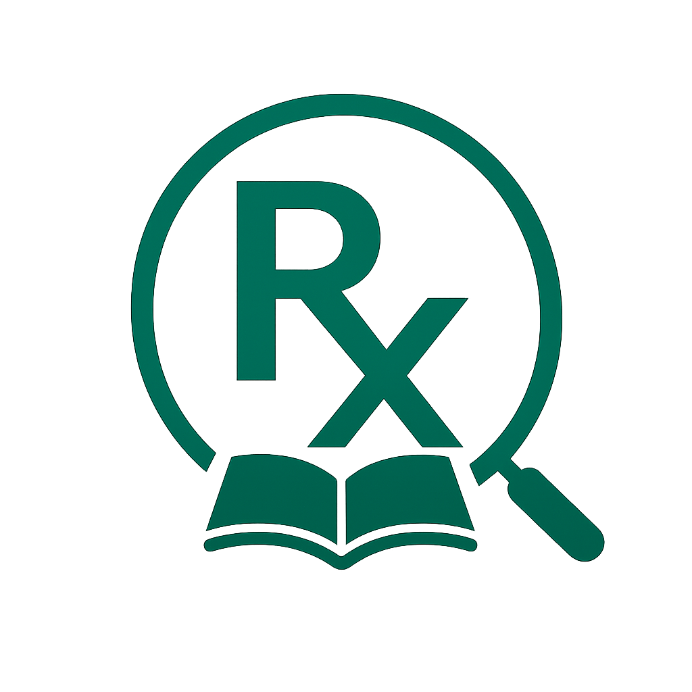
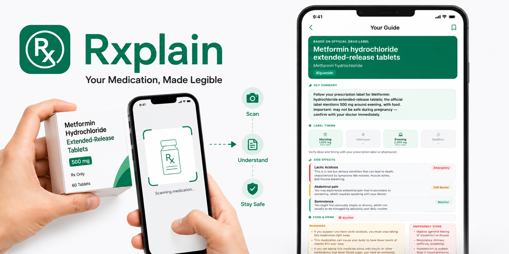

# Rxplain — Your Medication, Made Legible

<p align="center">
  
</p>

<p align="center">
  <a href="LICENSE"></a>
  <a href="https://www.kaggle.com/competitions/gemma-4-good-hackathon"></a>
  
  
</p>

> Turn any medicine box or drug name into a plain-language, personalized patient guide — powered by Gemma 4 and NIH DailyMed.

<p align="center">
  
</p>

---

## The Problem

A standard Warfarin leaflet: **5,000+ words · 8pt font · Dense medical terminology · No visuals · English only.**

A patient picks it up, reads two lines, and puts it down. Then they guess.

Medication leaflets are written for pharmacists, not patients — and the consequences are real. Nearly half of primary care patients misunderstand common dosage instructions on their prescription labels. For those with limited health literacy, the risk of misreading a warning label is 3.4× higher ([Davis et al., *Annals of Internal Medicine*, 2006](https://www.acpjournals.org/doi/10.7326/0003-4819-145-12-200612190-00144)). An estimated 125,000 people in the US alone die each year from preventable medication non-adherence.

This is not an information gap. It is a comprehension gap — and it disproportionately affects older adults, non-native speakers, and anyone managing a complex condition without reliable access to a clinician.

---

## What Rxplain Does

1. User fills in a temporary health profile (age, sex, conditions, allergies, current medications)
2. User photographs a medicine box with their camera, or types a drug name
3. Gemma 4 reads the photo and identifies the medicine
4. NIH DailyMed returns the official drug label
5. Gemma 4 extracts structured medication data from the label
6. Deterministic personalisation rules elevate warnings relevant to the user's profile
7. The app returns a mobile-friendly guide with:
   - A plain-English personalised summary
   - Morning / afternoon / evening / bedtime dosage timeline
   - Side effects ranked by severity (Emergency / Call doctor / Monitor)
   - Food and drink interactions
   - Warnings prioritised for the user's conditions and allergies
   - Emergency signs to watch for

---

## Gemma 4 in Action

Rxplain uses Gemma 4 for two distinct tasks:

### 1. Vision — Medicine Box Recognition (`src/vision.py`)

```python
messages = [{"role": "user", "content": [
    {"type": "image", "image": pil_image},
    {"type": "text",  "text": "What is the drug name shown on this box? Reply with ONLY the drug name."}
]}]
output = model.generate(**inputs, max_new_tokens=32, do_sample=False)
```

The model reads a photo of a medicine box and returns a clean drug name, stripping dosage numbers and brand taglines. This lets users scan a box instead of typing.

### 2. Structured Extraction — Label → Patient Guide (`src/extract.py`)

```python
prompt = f"""You are a clinical pharmacist AI. Extract medication information from the leaflet below.
Output ONLY valid JSON matching this schema: {schema}
LEAFLET TEXT: {leaflet_text}"""
output = model.generate(**inputs, max_new_tokens=3072, do_sample=False)
```

Gemma 4 reads up to 6,000 characters of the official NIH DailyMed label and returns a validated `DrugInfo` JSON object — side effects with severity levels, food interactions, patient-facing warnings, dosage instructions, and emergency signs.

The personalisation step (warning reordering, summary generation) is deliberately **not** an AI call — it is deterministic Python logic, making it auditable and safe.

---

## Evaluation Results

End-to-end smoke test across 10 common medications on Google Colab (L4 GPU):

| Drug | DailyMed | JSON valid | Guide | Seconds |
|---|:---:|:---:|:---:|---:|
| warfarin | ✅ | ✅ | ✅ | 57.39 |
| metformin | ✅ | ✅ | ✅ | 64.96 |
| ibuprofen | ✅ | ✅ | ✅ | 66.96 |
| amoxicillin | ✅ | ✅ | ✅ | 90.83 |
| atorvastatin | ✅ | ✅ | ✅ | 84.43 |
| lisinopril | ✅ | ✅ | ✅ | 86.19 |
| omeprazole | ✅ | ✅ | ✅ | 56.19 |
| albuterol | ✅ | ✅ | ✅ | 57.57 |
| levothyroxine | ✅ | ✅ | ✅ | 59.49 |
| acetaminophen | ✅ | ✅ | ✅ | 59.98 |

**10 / 10 guides generated successfully** — avg 68 s per guide on L4 GPU. Each passed DailyMed retrieval, Pydantic schema validation, and full HTML render. Reproducible via `scripts/evaluate_drugs.py`.

---

## Hackathon Track Fit

| Track | How Rxplain qualifies |
|---|---|
| **Health & Sciences** | Democratises official drug-label knowledge for patients and caregivers who cannot interpret clinical text; all output grounded in NIH DailyMed labels and validated by Pydantic schemas |
| **Digital Equity & Inclusivity** | Targets users with low health literacy, older adults, non-native speakers, and those without easy clinician access; personalisation logic is deterministic and auditable, not a black-box second model call |

---

## Project Structure

```
rxplain/
├── src/
│   ├── server.py       # FastAPI backend + HTML guide renderer
│   ├── index.html      # Mobile-first single-file frontend
│   ├── vision.py       # Gemma 4 vision — medicine box → drug name
│   ├── dailymed.py     # NIH DailyMed label retrieval + preprocessing
│   ├── extract.py      # Gemma 4 text — label → structured DrugInfo JSON
│   ├── personalise.py  # Deterministic profile-aware warning prioritisation
│   └── schema.py       # Pydantic data models
├── scripts/
│   └── evaluate_drugs.py  # Smoke-test helper for submission writeup
├── requirements.txt
└── LICENSE
```

---

## Safety Design

- All content is grounded in official NIH DailyMed drug labels — no free-form generation
- Model output is validated against strict Pydantic schemas before rendering
- Fixed enums for severity, food interaction type, and dosage timing prevent hallucinated categories
- Personalisation logic is deterministic Python, not a second model call
- Explicit "for reference only — consult your doctor or pharmacist" disclaimer throughout the UI
- No user data is stored or transmitted beyond the current session

**Known limitations:** DailyMed search returns the closest label match, which may differ in formulation or strength from the user's specific product. Dosage shown is from the label, not the user's prescription. English only in this prototype.

---

## Tech Stack

| Layer | Technology |
|---|---|
| Model inference | Gemma 4 (local, via `transformers`) |
| Vision input | Gemma 4 multimodal chat template |
| Structured output | Pydantic v2 |
| Drug data source | NIH DailyMed API |
| Backend | FastAPI + Uvicorn |
| Frontend | Single-file mobile HTML/CSS/JS |
| Camera input | `getUserMedia` API (desktop + mobile) |
| Demo environment | Google Colab (L4 GPU) |

---

## Where Rxplain Goes Next

The comprehension gap Rxplain addresses is global. Five directions with the highest potential impact:

**Multilingual output** — Mandarin, Spanish, and Indonesian together cover over 1.5 billion people, many in communities where health literacy gaps are most severe. A patient who can photograph a box but cannot read the guide in their own language is only half-served.

**Hospital discharge integration** — Today, patients leave a clinic with a drug bag and a receipt, often without knowing the generic name of what they've been prescribed. A simple QR code printed on the dispensing label can bridge this gap: scan → Rxplain guide loads pre-filled for that specific medication → patient sets a dosage reminder before leaving the pharmacy. This turns Rxplain from a lookup tool into a standard part of the discharge workflow, reaching patients at exactly the moment they need the information most.

**Medication reminders** — A guide that is read once and forgotten does not change behaviour. The logical extension of the health profile already collected is a lightweight reminder system: morning and evening push notifications tied to the dosage timeline already generated. The data is already there — it just needs a scheduler.

**Multi-drug interaction checks** — The patients who need Rxplain most — older adults managing chronic conditions — are also the most likely to be on multiple medications. Surfacing interactions across a user's full medication list is the natural next step for the health profile already collected.

**Offline label cache** — Digital equity means reaching users in low-bandwidth environments. Pre-caching common drug labels removes the DailyMed API dependency and makes Rxplain viable in rural clinics and underserved communities.

---

## Demo

**Rxplain — Personalized Medication Guides Powered by Gemma 4**

<p align="center">
  <a href="https://youtu.be/Z60CHS4Y0KA">
    
  </a>
</p>

[](https://colab.research.google.com/drive/1JCgQPB0JUsRntVpPzwljnRXo01ABTuyF?usp=sharing)

> **Requires a GPU runtime.** In Colab: *Runtime → Change runtime type → L4 GPU* (or equivalent).

The notebook is a self-contained six-cell pipeline — open it and run all cells in order:

| Cell | What it does |
|---|---|
| 1 · Environment Check | Verifies GPU availability and Python version |
| 2 · Install Dependencies | Installs `requirements.txt` and `torch transformers accelerate` |
| 3 · Load Model | Downloads and loads the Gemma 4 checkpoint (~10 min on first run) |
| 4 · Load Source Modules | Imports the Rxplain pipeline from `src/` |
| 5 · Launch | Starts the FastAPI server on port 7860 — open the Colab tunnel URL to use the UI |
| 6 · Evaluate *(optional)* | Runs `evaluate_drugs()` smoke test across 10 common medications |

---

## Author & License

Rxplain was built by **[Lorraine Wong](https://github.com/LorraineWong)** as a submission for the [Gemma 4 Good Hackathon 2026](https://www.kaggle.com/competitions/gemma-4-good-hackathon).

The project is released under the [Apache 2.0 License](LICENSE) and is free to use, modify, and deploy — including for institutional, clinical, and commercial purposes.

> **Medical Disclaimer:** Rxplain is a prototype, not a certified medical device. All content is sourced from official NIH DailyMed labels and presented for informational purposes only. Always consult a qualified pharmacist or physician before making medication decisions.
